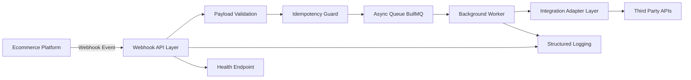
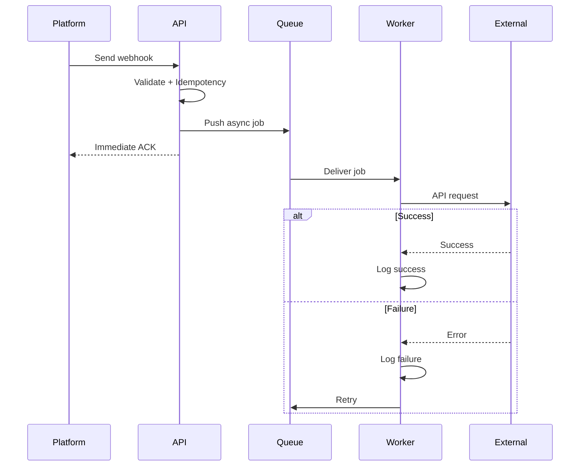
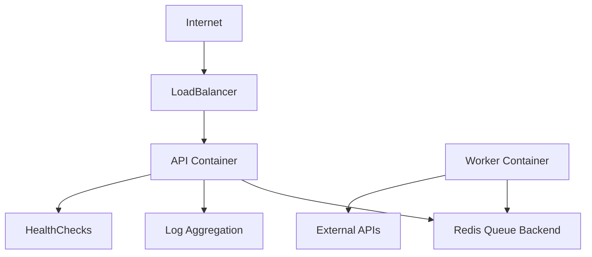
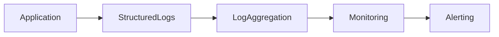

# Ecommerce Backend Reliability Demo

Production-style backend reliability service demonstrating resilient webhook processing, async workflows, monitoring-first architecture, and failure-safe integrations commonly required in ecommerce systems.

---

## High-Level Architecture



---

## Event Processing Flow



---

## Production Deployment Architecture



---

## Observability Architecture



---

## Architecture Principles

### Failure-First Design

System assumes:

- Duplicate webhook delivery
- External API downtime
- Network latency or timeout
- Partial system failures

Mitigation:

- Idempotency protection
- Async processing
- Retry-safe integration layer

---

### Async Processing

HTTP layer:

- Validate request
- Enforce idempotency
- Queue work
- Respond immediately

Worker layer:

- Process integrations
- Handle retries
- Log outcomes

---

### Integration Isolation

External services wrapped behind adapters:

- Centralized timeout handling
- Consistent error structure
- Retry-ready logic

---

### Observability-First

Structured logs provide:

- Request tracing
- Debuggable failures
- Operational clarity

---

## Real-world Failure Scenarios

- Duplicate webhook retries handled via idempotency.
- External API failures isolated via worker queue.
- Slow integrations prevented from blocking API layer.
- Structured logs support debugging.

---

## Project Structure

```
src/
api/
routes/
middleware/
queue/
workers/
integrations/
docs/
```

---

## Local Setup

Clone:

```
git clone https://github.com/vishnuvardhanburri/ecommerce-backend-reliability-demo.git
```

Install:

```
npm install
```

Start:

```
docker-compose up
npm start
```

---

## Health Check

GET /health

```
{ "status": "ok" }
```
